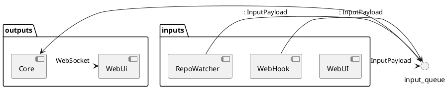

# WaterCore

Contient l'ordonanceur, celui qui va recevoir et distribuer les jobs.

J'ai besoin de:
- Une interface TCP pour recevoir des jobs
- Une queue interne pour stocker ces jobs
- Une interface TCP pour recevoir les connexions des exécuteurs
- Boucler sur ces exécuteurs pour dispatcher les exécuteurs